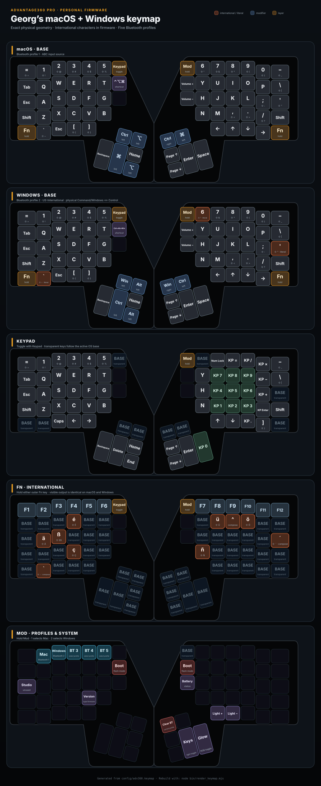

# Georg’s Advantage360 Pro configuration

This is my personal firmware configuration for the Kinesis Advantage360 Pro. It
adds separate macOS and Windows modes, firmware-level international characters,
and two Bluetooth names for my two keyboards.

For the original setup, build, flashing, reset, and customization instructions,
see the
[official Kinesis Advantage360 Pro ZMK README](https://github.com/KinesisCorporation/Adv360-Pro-ZMK/blob/V3.0/README.md).

[](assets/keymap.svg)

_Click the diagram to open the full-size SVG. It is generated directly from
`config/adv360.keymap` using `node bin/render_keymap.mjs`._

## Changes from the original configuration

### Two keyboard identities

Every GitHub Actions run creates two firmware artifacts:

| Artifact | Bluetooth/USB name | Intended keyboard |
| --- | --- | --- |
| `firmware` | `Adv360 Pro` | Personal keyboard |
| `firmware-work` | `Adv360 Pro Work` | Work keyboard |

The names can be changed in
[`config/keyboard-name-standard.conf`](config/keyboard-name-standard.conf) and
[`config/keyboard-name-work.conf`](config/keyboard-name-work.conf). The old
Clique build is no longer produced.

When changing the name of an already paired keyboard, reset the settings on both
halves, flash the matching left and right firmware, remove the old Bluetooth
pairing from the computer, and pair it again.

### macOS and Windows profiles

| Shortcut | Connection | Keymap |
| --- | --- | --- |
| `Mod+1` | Bluetooth profile 1 | macOS |
| `Mod+2` | Bluetooth profile 2 | Windows |
| `Mod+3` to `Mod+5` | Bluetooth profiles 3–5 | Keep the currently selected OS keymap |

The macOS layer keeps the original modifier positions. The Windows layer swaps
Command/Windows and Control, including the thumb key. The same physical
shortcut therefore produces `Command+C/V/Z` on macOS and `Ctrl+C/V/Z` on
Windows.

The Bluetooth profile persists after a restart, but the selected OS layer does
not. When using Windows after powering on the keyboard, press `Mod+2` once.

### International characters

Both OS modes use the same physical shortcuts:

| Shortcut | Output | With Shift |
| --- | --- | --- |
| `Fn+A` | `ä` | `Ä` |
| `Fn+O` | `ö` | `Ö` |
| `Fn+U` | `ü` | `Ü` |
| `Fn+S` | `ß` | `SS` |
| `Fn+E` | `é` | `É` |
| `Fn+N` | `ñ` | `Ñ` |
| `Fn+C` | `ç` | `Ç` |

Additional accents are available as composition keys:

| Accent | Shortcut | Example |
| --- | --- | --- |
| Acute | `Fn+'` | `Fn+'`, then `a` → `á` |
| Diaeresis | `Fn+"` | `Fn+"`, then `e` → `ë` |
| Grave | ``Fn+` `` | ``Fn+` ``, then `e` → `è` |
| Tilde | `Fn+~` | `Fn+~`, then `n` → `ñ` |
| Circumflex | `Fn+I` | `Fn+I`, then `e` → `ê` |

For an uppercase composed character, hold Shift only while typing the final
letter.

The macOS mode expects the `ABC` input source. The Windows mode expects
`English (United States, International)`, including when it appears under
`Deutsch (Deutschland)`. Plain `US` is not compatible with these shortcuts.

Windows US-International normally makes apostrophe, quote, grave, tilde, and
caret dead keys. In the Windows layer their normal key positions emit literal
punctuation immediately; their dead-key versions remain available through the
Fn composition shortcuts.

### Reproducible keymap diagram

[`bin/render_keymap.mjs`](bin/render_keymap.mjs) reads the real key bindings from
`config/adv360.keymap` and the physical Kinesis geometry from `config/info.json`,
then regenerates `assets/keymap.svg`:

```shell
node bin/render_keymap.mjs
```
